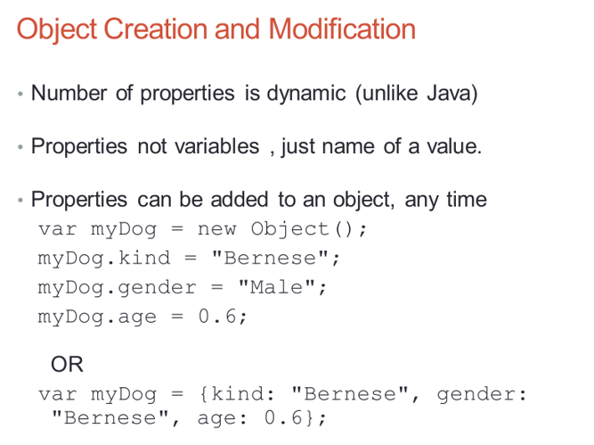
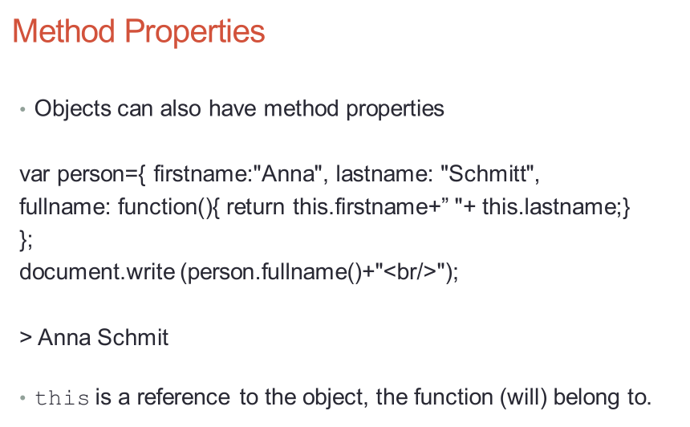

# JavaScript

* JavaScript is the programming language of html and the web
* the core of the language
* client-side supports control of browser and interaction with users, more popular
* server-side to control interaction with Web server
* Inheritance: the capability of a class to rely on another class for some of its properties and methods
* Polymorphism: the capability to write one function or method that works in a variety of ways
* Javascript code referred to as a script, scripts can be explicitly or implicitly embedded in html

* Explicit embedding in html code not always ideal

  1. can be in the page&#39;s &lt;head&gt; element: if is a script what reacts to user action or only when requested
  2. can be in the page&#39;s &lt;body&gt; element: when script that is interpreted only once

* Implicit embedding in a separate file (.js)

  1. hides the scripts from browsers
  2. uses when JS code is meant for more than one page

## General syntax

* Import a JS file: &lt;script type = &quot;text/javaScript&quot; src = &quot;xxx.js&quot;&gt; &lt;/script&gt;

* Embed JS code: &lt;script type = &quot;text/javaScript&quot;&gt; &lt;/script&gt;

## Output

* document.getElementByID(&quot;id&quot;). innerHTML=
  * to access an html element and writing into the element
* document.write(&quot;…&quot;);
  * usually for testing purpose, using it after an html is loaded, will delete all existing html
* window.alert(&quot;…&quot;);
  * displays data through an alert box
* Console.log("...");
  * displays message to ourselves
* window.confirm(&quot;…&quot;)
  * used if you want the user to verify or accept something
* window.prompt(&quot;…&quot;, &quot;…&quot;)
  * used if you want the user input value before entering a page
* &lt;button type = &quot;button&quot; onclick = &quot;function&quot;&gt;xxx&lt;/button&gt;

## Variables

* all JS variables must be identified with unique names called identifiers
* names can contain letters, digits, underscores, and dollar signs, must begin with a letter
* identify method: var name; can store numbers, String, Boolean
  * null: a variable is null when not declared or not explicitly assigned a value, has only one value – null, cannot be used as the name of a function or variable, can erase the variables by assigning it to null
  * undefined: when declared but not assigned a value, has only one value – undefined
  * lent: have block{} scope, cannot be accessed from outside the block

## Numerical Operations

* numeric operators: \_, -, \*, / , %
* shortcut operators: ++, --, +=, -=, \*=, /=, %=
* Math.max (x, y, z,…, n); returns the largest value
* Math.ceil (x); returns x, rounded upwards to the nearest integer
* Math.PI; returns pi
* Math.sqrt(x); returns the square root of x
* An arithmetic operation that creates overflow return NaN, which means not a number
* isNaN(); check whether a value is NaN, if yes, then returns true, Boolean and null will be converted to 0 or 1, String will be converted to number if they can
* toString(); converts a number to a String
* String(num); converts num to a String with constructor
* toFixed(a); return the number written with a specified number of decimals
* parseInt(), parseFloat(); converts variables to a number

## String operations

* when both sides are numbers, + is addition; otherwise, String concatenation
* when using non-string operator with strings, will try to convert string to number, or returns NaN
* when using comparison operators
  * if one side is number, the other can be converted to a number, then number comparison
  * if one side is number, the other cannot be converted to a number, always false
  * if two strings, then string comparison based on the ASCII of the first different character

* length; returns the length of a String
* charAt(index); returns the character at the specified index
* indexOf(st1); returns the index of the first found occurrence of the specified string; if not, -1
* lastIndexOf(st1); returns the index of the last found occurrence of the specified string; if not. -1
* endsWith(str1); checks whether a String contains the specified string
* repeat(count); returns a new String with a specified number of copies
* replace(str1,str2); replaces specified value str1 with str2, /str1/g-all values, /str1/gi-all values ignore case
* substring(start,(end)); extract the characters form a String, including start but end
* substr(start,length); extract form the start, but if a negative number, it will return from the last position
* concat(str1); joins two or more strings
* toLowerCase(); toUpperCase();
* split(delimeter); split a string into an array of substrings

## Date

* var d =
  * new Date(); creates a new date object with the current date and time
  * new Date(year, month, day, hour, minute, second, millisecond)
  * new Date(dateString); creates a new date object from a date string

* toLocalString(); returns a string of the date
* getFullYear(); returns the year as a four digit number
* getMonth(); returns the month as a number (0-11)
* getDate(); returns the date as a number(1-31)
* getHours(); returns the hour(0-23)
* getMinutes(); returns the minute(0-59)
* getSeconds(); returns the second(0-59)
* getMilliSeconds(); returns the millisecond(0-999)
* getTime(); returns the milliseconds since January 1, 1970
* getDay(); returns the weekday(0-6)
* also has the set methods

## Arrays

* can have variables of different types in a same array, including objects, arrays, and functions
* var a = new Array(x,x,x,x,x);  new Array(x); creates an array with x undefined elements
* var a = [x,x,x,x,x]; **best format**
* accessing an undefined array entry gives the value undefined
* assigning to an element beyond the end of the array increases its length
* using a for loop to iterate an array
* .length; returns the number of elements
* toString(); converts an array to a string of array values; actually JS automatically converts
* join(&quot;\*&quot;); like toString, but in addition you can specify the separator
* pop(); removes and returns the last element from an array
* shift(); removes and returns first element
* unshift(x,x,…); inserts elements in front and returns new length
* push(x,x,x,x); adds a new element to an array at the end, and returns the new array length
* concat(arr2,…); returns a new array by joining the array with the given arrays
* reverse(); changes the array itself to go backward
* .sort(); sorts arrays alphabetically
* split(delimeter); split a string into an array of substrings
* splice(index, howmany, i1,i2,…); adds/removes items to/from an array, and returns the removed items
* slice(index1.index2); slices out a piece of an array into a new array
* forEach(function); calls a function once for each array element

## Comparison

* == equal to
* ==== equal value and equal type
* != not equal
* !== not equal value or not equal type
* &gt;, &lt; , &gt;=, &lt;=, &amp;&amp;, ||, !

## Control  and flow statements

* for(statement 1; statement 2; statement 3){ codes}
* for(var in arr){codes}
* while(condition){}; do{}wihle();
* if-else; switch

## Functions Syntax

* function name(param list) {codes}
* can have parameters, no data type specified for params,
* no check on the number of parameters received, missing params are set to undefined
* JS functions have a built-in object called arguments object which is an array of params
* function definitions placed in &lt;head&gt; of an html
* good habit to declare variables in a function
  * a variable declared with a var is local to that function and exists for the processing time of that function
  * a variable declared without a var is global, even if it is assigned inside a function
  * a variable declared at the top of a JS function lives on from the moment the file is loaded

## Object

JS is not an OOP language

## Pattern matching

* using RegExp objects, a regular expression is a sequence of characters that forms a search pattern
  syntax: /pattern/modifier or using methods on string objects
* normal characters (match themselves)
* metacharacters (can have special meanings in patterns – do not match themselves)
  \ | ( ) { } [] ^ $ \* + ? . period matches any character except new line
* search(/pattern/)
  * returns the position in the object string of the pattern, returns -1 if it fails
* [Online RegExg Test](https://regex101.com/)

## Character classes

* put a sequence of characters in brackets [], and it defines a set of characters, any one of which matches
* [abc] a single character of a, b, or c
* [a-z] a single character in the range a-z
* [&and;0-9]a single character not in the range 0-9
* \d        [0-9]                        a digit
* \D        [&and;0-9]                        not a digit
* \w        [A-Za-z\_0-9]                a word character
* \W        [&and;A-Za-z\_0-9]        not a word character
* \s        [\r\t\n\f]                        a whitespace character
* \S        [&and;\r\t\n\f]                        not a whitespace character
* \d\*        0 or more digits
* \d+        1 or more digits
* \d?        0 or 1 digit
* /abc/        matches 1st occurrence of string &#39;abc&#39;
* /ab\*b/        begins with one a, followed by any number of one b, followed by one c
* /ab+c/        begins with one a, followed by at least one b, followed by one c
* /ab{2,}c/        begins with one a, followed by two or more b followed by one c
* /(ab)\*c/        begins with some ab, followed by one c
* /(ab)?c/        begins with at most one ab, followed by one c
* /[abc]/        matches 1st occurrence of a, b, or c
* /^[abc]\d/        starts with one a, b, or c, followed by a digit
* /^[abc]/        is the letter a, b or c, must be at the front of string
* /[abc]\d$/        has the letter a, b, or c, followed by a digit at the end
* /\d{1,2}/        matches 1st occurrence of one or two digits
* /\d[1-9]\d/        matches 1st occurrence of one 2 digits number not starting with 0
* (?!.\*u)        do not include letter u
* ^(?![0-9]+$)(?![a-zA-Z]+$)[0-9A-Za-z]{8,16}$

## DOM

1. a standard for accessing documents: Document Object Model
   
2. a standard object model and programming interface for HTML. It defines: the HTML elements as objects, the properties of all HTML elements, the methods to access all HTML elements, the events for all HTML elements. In other words, DOM is a standard for how to get, change, add, or delete HTML elements
3. In the DOM, all HTML elements are defined as objects:
4. a property is a value that you can get or set
5. a method is an action you can do

* getElemmentById(&quot;id&quot;); 
  * most common way to access an HTML element, finding an element by element id
* getElementsByTagName(&quot;tag&quot;);
  * find elements by tag name
* getElementsByClassName(&quot;class&quot;);
  * find elements by class name
  * return a Nodelist of all elements with the specified name or classname
  * element can be accessed through their node number
* querySelector("cssSelector");
  * Return the first element that mathes a given CSS-style selector
* querySelectorAll("cssSelector");
  * return a list of elements that matches a given CSS- style selector
* innerHTML; 
  * the easiest way to get and change the content of an element
* setAttribut(&quot;attribute&quot;, &quot;newvalue&quot;); 
  * change the attribute of an element
* style.attribute = newvalue; 
  * change the style of an element
* document.createElement(element); 
  * create an html element
* document.removeChild(element); 
  * remove an html element
* document.appendChild(element); 
  * add an html element or element node
* document.replaceChild(new, old); 
  * replace an html element
* doucument.write(text); 
  * write in the html output stream
* document.createTextNode(text); 
  * create an text node
* document.forms.length; 
  * get the number of form elements
* to add a new element to the HTML DOM, you must create the element (element node) first, and then append it to an existing element
* node properties to navigate between nodes with js
* parentNote, childNodes[nodenumber], firstChild, lastChild, nextSibling, previousSibling

## Access elements

1. DOM address: use the forms and element arrays of the Document object 
2. Element names: requires the element and all of its ancestors (except body) to have name attributes  
3. getElementById method

## Navigation

nodeName—specifies the name of a node
    
nodeValue—specifies the value of a node

## Event attributes

onclick, onload, onmouseover, onmouseout, onblur

* element.addEventListener(type, functionToCall);